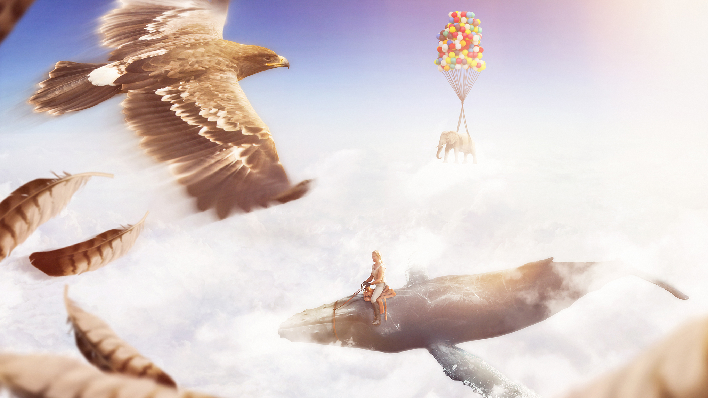

Bevor ein Compositing überhaupt erst entstehen kann, braucht es die zündende Idee. Und diese kann auf ganz unterschiedliche Arten entstehen: Mal müssen Rahmenbedingungen (z.B. bei Wettbewerben) eingehalten werden, mal soll ein eine Stimmung/Gefühl transportiert werden, mal soll es ein Geschenk werden – aber meistens kommen die Ideen spontan während man seine Umwelt beobachtet.

In diesem Teil der Reihe soll es um die Konzeption gehen, die für mich die Schritte Idee, Skizze und Komposition umfasst. Ich werde hierbei erklären, wie ich persönlich vorgehe wenn ich ein Compositing erstellen will. Ich erkläre die Vorgehensweise anhand meines Bildes *Eagle*:

## Idee

Die Idee muss oftmals gar nicht kompliziert oder schwierig zu erklären sein, um ein Bild mit einer Aussage zu erstellen, sondern sollte vor allem **eindeutig erkennbar** sein. Inspiration findest du in deiner Umgebung, besonders im Internet, und kann dir ermöglichen auf die verrücktesten Ideen zu kommen. Schreib dir die Ideen erstmal auf, egal wie abwegig sie sind – sie können immer noch später aussortiert oder angepasst werden. Solltest du gewisse Vorgaben haben wie Wettbewerbsbedingungen oder einen Bezug zu einer Person (Geschenk) musst du deine Gedanken besonders um diese Elemente kreisen lassen, immerhin muss das Bild diese Nachricht transportieren.

Im Falle von *Eagle* war meine Grundidee, dass ich Tiere zum Fliegen bringen will. Daraus entstand dann im weiteren Verlauf das Konzept, dass ich ein Tier in seiner natürlichen Umgebung zeige, ein Tier in ein anderes Gebiet übertrage und ein Tier nur durch Hilfsmittel zum Fliegen bringe. Was ich damit meine: Der Adler ist in seinem eigenen Habitat, der Wal „schwimmt“ durch die Wolken (statt Wasser) und der Elefant wird nur durch die Luftballons nach oben getragen.

## Skizze & Komposition
Du musst nicht gut zeichnen können! Es ist egal, ob du die Skizze auf dem Tablet erstellst oder klassisch mit dem Bleistift auf Papier. Die Skizze muss vor allem dir helfen und kann daher hässlich & ungenau sein, solange du damit deine Idee aus dem Kopf auf das Papier bringst. So kannst du im späteren Verlauf immer wieder auf diese schauen und hast einen klaren roten Faden.

Für mich muss eine Skizze bereits einige Dinge festhalten, die sich dann später nicht mehr ändern werden. Dazu zähle ich das Format und die Ausrichtung, alles andere darf im weiteren Verlauf noch geändert werden. Mehr als grobe Formen und Stichpunkte sind meine Skizzen nicht. Somit verliere ich mich auch nicht in den Details, sondern kann mehr auf die Komposition achten. Wikipedia definiert diese so:

> In der bildenden Kunst ist die Komposition eine Bezeichnung für den formalen Aufbau von Kunstwerken, der die Beziehungen der Gestaltungselemente untereinander betrifft. Der Begriff wird nicht nur bei flächigen Techniken (Gemälde, Zeichnung, Grafik, Relief) angewendet. Auch in der Plastik, Skulptur, besonders bei Skulpturengruppen, und in der Architektur spricht man von Kompositionen, die auch räumlich verstanden werden können. Zu Elementen der Komposition zählen:
> - Anordnung der Figuren/Gegenstände
> - Kompositionsschema, sphärische oder geometrische Beziehungsverhältnisse wie zum Beispiel die Dreieckskomposition und die Diagonalmethode
> - Perspektive
> - Proportionslehre
> - Linien (wirkliche sowie gedachte)
> - goldener Schnitt
> - Flächenhaftigkeit
> - Symmetrie
> - Licht
> - Ordnungsprinzipien: Reihung, Ballung, Gruppierung, Streuung, Symmetrie, Asymmetrie, Struktur, Raster, Schwerpunkt, Kontraste, Dynamik, Statik
> - Farbe
> 
> [Quelle](https://de.wikipedia.org/wiki/Komposition_(Bildende_Kunst))

Und genau diese Elemente beachte ich bei meinen Skizzen und Stichpunkten. Ein weiterer Vorteil die Elemente bereits miteinzubeziehen ist das frühe Erkennen von logischen oder inhaltlichen Fehlern. Bereits in dieser Phase sind Fehler aufspürbar, z.B. dass die Perspektive des Objekts in der Position nie möglich wäre.

Für *Eagle* habe ich in den Skizzen ausprobiert, welche Reihenfolge der Tiere mir am besten gefällt und in welchem Abstand diese voneinander zu sehen sein sollen. Auch hatte ich schon entschieden, dass von einer Seite die Sonne reinscheinen und das Bild eine warme Stimmung haben soll.

## Zusammenfassung

Skizzen können während der Erstellung ungemein hilfreich sein, da sie den roten Faden vorgeben. Du kannst die Skizze so ungenau oder detailliert erstellen wie du willst, allerdings solltest du die wichtigsten Elemente der Komposition bereits festlegen, da z.B. die Suche nach Stock-Fotos leichter von der Hand geht und Fehler früh erkannt werden können.